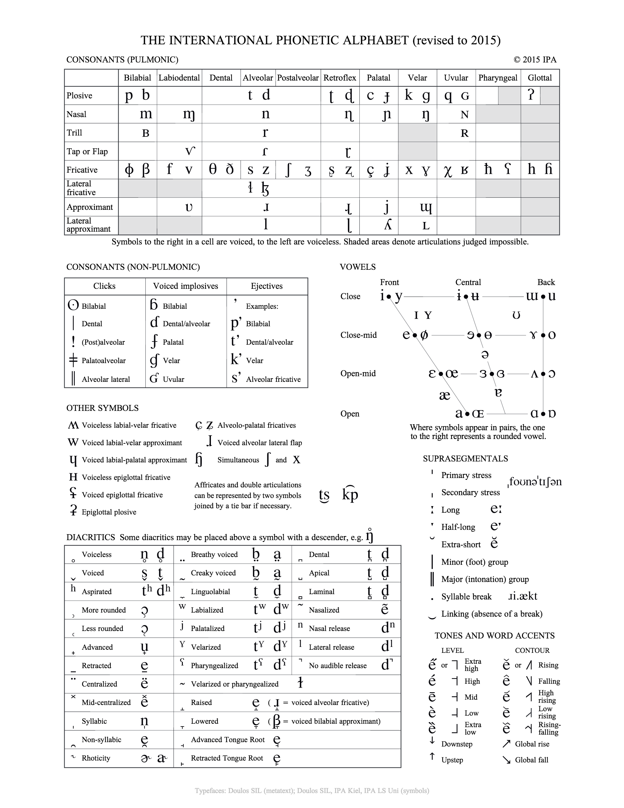

# International Phonetic Alphabet Data

[![version][version-badge]][CHANGELOG] [![license][license-badge]][LICENSE]

Data for the International Phonetic Alphabet (IPA). These open-access datasets reflect the information on the [IPA Chart] and the listed [references].

## Data serializations
* [ipa-data.csv]

## IPA Chart
IPA Chart, https://www.internationalphoneticassociation.org/content/ipa-chart, available under a [Creative Commons Attribution-Sharealike 3.0 Unported License]. Copyright © 2015 [International Phonetic Association].

## References
[International Phonetic Association]. (1999). *[Handbook of the International Phonetic Association]: A guide to the use
of the International Phonetic Alphabet*. Cambridge: Cambridge University Press.

[ipa-data.csv]: ./datasets/ipa-data/ipa-data.csv

[IPA Chart]: #ipa-chart
[references]: #references

[CHANGELOG]: ./CHANGELOG.md
[version-badge]: https://img.shields.io/badge/od--api--xquery-unreleased-0038e2.svg?style=flat-square

[LICENSE]: ./LICENSE
[Creative Commons Attribution-Sharealike 3.0 Unported License]: ./LICENSE
[license-badge]: https://img.shields.io/badge/license-CC--BY--SA_3.0-0038e2.svg?style=flat-square

[Handbook of the International Phonetic Association]: https://www.internationalphoneticassociation.org/content/handbook-ipa
[International Phonetic Association]: https://www.internationalphoneticassociation.org/